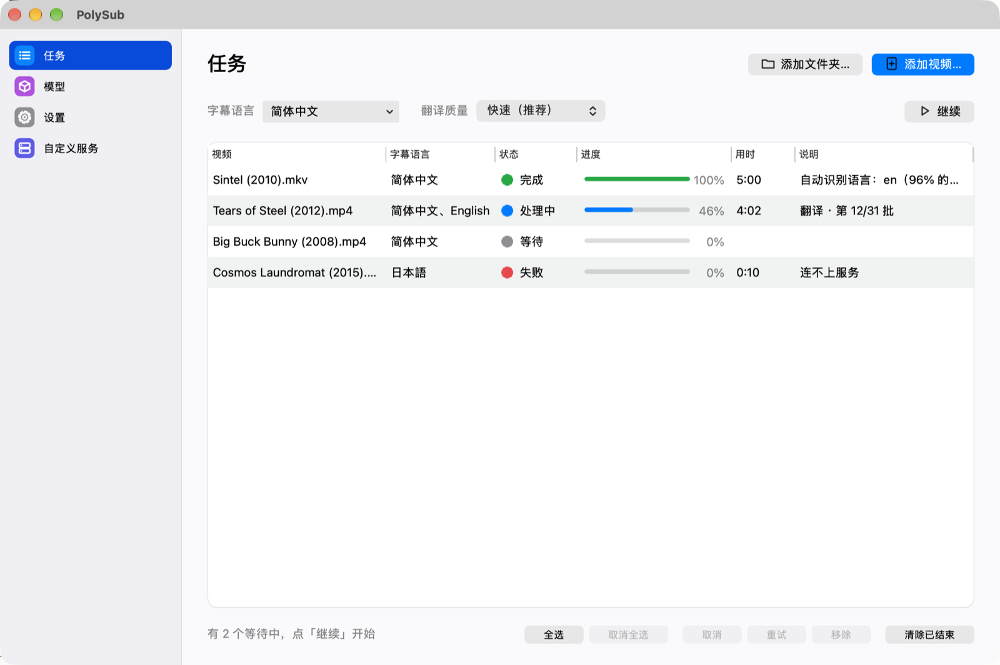

# PolySub

[](https://github.com/hongyukeji/polysub/actions/workflows/ci.yml)
[](https://github.com/hongyukeji/polysub/releases/latest)
[](LICENSE)

中文 | [English](README.en.md)

面向 Apple Silicon Mac 的免费开源字幕工具：识别视频里的语音，结合全片上下文翻译成任意语言，字幕文件直接放在视频旁边。自带本机识别和翻译引擎，装好下载一次模型就能用，不需要另装软件或 API Key；想要更高精度，可以改用自己的模型（例如 [oMLX](https://github.com/jundot/omlx) 上的大模型）或任何 OpenAI 兼容的云端接口。

[安装](#安装) · [使用](#使用) · [模型与接口](#模型与接口) · [更新](#更新) · [卸载](#卸载) · [数据与缓存](#数据与缓存) · [常见问题](#常见问题) · [开发与贡献](#开发与贡献)

## 功能与界面

- **任意语言字幕**：自动识别视频原语言，一次生成一种或多种目标语言；多种语言时语音只识别一次。
- **带上下文的翻译**：先通读全片原文，整理场景、人物和人名写法，再带着这些信息和前文分批翻译；人名提示还会用于第二遍语音识别，修正同音错字。
- **开箱即用**：自带 whisper.cpp（识别）和 llama.cpp（翻译）本机引擎，首次打开按内存推荐档位、一键下载模型（可断点续传，可选国内镜像）。
- **也能用自己的模型**：任务页「翻译质量」选「我的模型」即切到高级设置里配好的组合；支持本机 oMLX、Ollama、LM Studio 和 DeepSeek、阿里云百炼、OpenAI 等 OpenAI 兼容接口，也可以让内置引擎加载自己的 GGUF 文件；云端拒绝的批次自动改用备用接口。
- **后台队列**：把视频或文件夹拖进窗口或 Dock 图标，逐个在后台处理，关掉窗口也不停；支持暂停、取消、重试，每个完成时有系统通知。
- **字幕编辑**：双击完成的视频，原文和译文逐行对照，可以搜索、手改、选中几行重新翻译。
- **命令行**：同一套功能也可以在终端里用，适合批量和脚本。

字幕保存为 `视频名.语言.srt`（也支持 ASS、VTT），IINA 等播放器会自动加载。

下面是 PolySub 的任务页（示例视频为 Blender 开放电影）：



## 系统要求

- Apple Silicon Mac，macOS 13 或更高版本；不支持 Intel Mac。
- 默认的内置引擎不需要另装软件，首次打开按内存推荐档位：8 GB 用「轻量」（约 4.4 GB），16 GB 用「标准」（约 5 GB），32 GB 及以上用「高质量」（约 19 GB）。
- 进阶（可选）：用自己的模型时，本机推荐 [oMLX](https://github.com/jundot/omlx)（大模型需要较大内存）；云端接口需要对应平台的 API Key。

当前实机验证以 M4 Max（64 GB）MacBook Pro、macOS 27 为主，其他机型的速度会不同。

## 安装

以下三种方式**选择一种即可**。

| 安装方式 | 适合场景 | 首次打开有无安全提示 |
| --- | --- | --- |
| Homebrew（推荐） | 用 Homebrew 安装和升级 | 无 |
| 下载发行包 | 不想装 Homebrew | 有，需要在系统设置里允许一次 |
| 源码构建 | 修改代码、调试 | 无 |

### 方式一：通过 Homebrew 安装

前提：已安装 [Homebrew](https://brew.sh/zh-cn/)。不需要 Xcode。

```bash
brew tap hongyukeji/tap
brew trust hongyukeji/tap
brew install polysub
polysub install
open /Applications/PolySub.app
```

Homebrew 7 起默认不加载第三方 tap 的配方，需要先用 `brew trust` 信任本 tap（只需一次）。`brew install` 把应用和 `polysub` 命令装进 Homebrew；`polysub install` 把 PolySub.app 复制到「应用程序」。配方维护在 [hongyukeji/homebrew-tap](https://github.com/hongyukeji/homebrew-tap)。

### 方式二：下载发行包安装

1. 前往 [Releases](https://github.com/hongyukeji/polysub/releases/latest)，下载 `PolySub-版本号-macos-arm64.zip`（不要选 GitHub 自动生成的 `Source code`）。
2. 双击解压，把 `PolySub.app` 拖进「应用程序」。
3. 打开 PolySub。发行包没有经过 Apple 公证，首次打开会被拦下，处理方法见[常见问题](#下载后提示无法验证开发者)。

需要命令行时，在 App 菜单「文件 → 安装命令行工具 polysub…」里安装。

### 方式三：从源码构建

前提：已安装 [uv](https://docs.astral.sh/uv/)、Xcode 命令行工具和 cmake（用来编译内置引擎）：

```bash
xcode-select --install
brew install uv cmake
```

```bash
git clone https://github.com/hongyukeji/polysub.git
cd polysub
scripts/install.sh --app
```

脚本会准备 Python 环境、把 `polysub` 命令链接到 `~/.local/bin`，并在项目目录生成 `PolySub.app`（打包时会从源码编译内置的 whisper.cpp、llama.cpp 引擎，第一次约 10 分钟，之后复用）。默认构建 `main` 分支；需要指定版本时先 `git checkout v版本号`。

不打包、直接从源码运行时，先编译一次引擎：

```bash
packaging/engines/fetch.sh --dev   # 编译到用户缓存目录，PolySub 从源码运行时会在这里找引擎
uv sync --extra gui
uv run polysub gui
```

### 安装完成后

第一次打开时（内置模型还没下载）会弹出引导：显示本机内存和推荐档位，选好下载源后点「开始下载」，下载可以放到后台继续；模型没下完时拖进来的视频会排队等待。之后可以在左侧栏的「模型」页查看状态、下载或删除模型。

所有用户默认都用内置引擎，包括已经装了 oMLX 的用户。从旧版本升级时，原来用的识别和翻译组合（例如 oMLX 上的模型）会自动移到「我的模型」：任务页「翻译质量」选「我的模型」就能切回去；原来默认的「标准」档会改为新的默认「快速」档。

## 使用

### App

把视频或文件夹拖进窗口（或拖到 Dock 图标上），选好字幕语言和翻译质量即可。

| 翻译质量 | 行为 |
| --- | --- |
| 快速（推荐，新安装的默认） | 不思考，逐行翻译、4 行并行，最快 |
| 标准 | 每批少量思考，每批 20 行；M4 Max 用本机模型，2 小时的片子约 10 分钟 |
| 精细 | 不限思考，约慢 3 倍 |

| 我的模型 | 用「设置 › 高级 › 我的模型」里配好的服务和模型（例如 oMLX 大模型或云端） |

完成的任务可以右键「用其他质量重新翻译」，识别结果直接复用，只重做翻译。

窗口左侧栏有四页：「任务」看队列；「模型」管理内置模型、做环境检查、查看文件位置；「设置」（⌘,）管理原语言、字幕格式和翻译质量，改动自动保存，识别与翻译用哪个服务、「我的模型」、翻译细节、内置引擎参数和监视文件夹在「显示高级设置」里；「自定义服务」管理本机和云端接口。⌘1–⌘4 切换页面，⌘O 添加视频；任务页右上角是「添加文件夹」「添加视频」，下面一行可以暂停 / 继续队列。

### 常用命令

| 命令 | 用途 |
| --- | --- |
| `polysub 电影.mp4` | 立即生成字幕（原语言自动识别，目标语言取设置） |
| `polysub -t zh-Hans,en 电影.mp4` | 同时生成简体中文和英文字幕 |
| `polysub -f ja --think off 电影.mp4` | 指定原语言为日语，用「快速」档翻译 |
| `polysub queue add ~/Movies/某剧` | 整个文件夹加入后台队列 |
| `polysub queue list` | 查看队列 |
| `polysub queue watch ~/Downloads` | 监视文件夹，新出现的视频自动加入队列 |
| `polysub models download` | 按内存下载推荐档位的内置模型（`--tier`、`--source mirror` 可选） |
| `polysub engine status` | 查看内置引擎是否在运行（空闲 10 分钟自动退出；`engine stop` 立即停止） |
| `polysub models list` | 查看内置模型和下载状态 |
| `polysub endpoints test 名称` | 测试某个接口能否连通 |
| `polysub doctor` | 检查运行环境 |
| `polysub gui` | 打开图形界面 |
| `polysub install` | 把 PolySub.app 复制到「应用程序」 |
| `polysub --help` | 查看全部命令；单个命令可追加 `--help` |

App 和命令行共用同一份设置和队列。

## 模型与接口

默认用内置引擎：PolySub 自带 llama.cpp（识别和翻译都用它；Whisper 模型用 whisper.cpp），在需要时于本机 `127.0.0.1` 启动，App、后台队列和命令行共用，空闲 10 分钟后自动退出。不用 Ollama：它本身也是基于 llama.cpp，但要另装、常驻后台，而且不支持 Qwen3-ASR 这类语音模型；已经在用 Ollama 的，可以在「自定义服务」里添加。

| 档位 | 语音识别 | 翻译 | 适合 |
| --- | --- | --- | --- |
| 轻量 | Qwen3-ASR 1.7B（Q8） | Qwen3 1.7B（Q8） | 8 GB 内存 |
| 标准 | Qwen3-ASR 1.7B（Q8） | Qwen3 4B（Q4_K_M） | 16 GB 内存 |
| 高质量 | Qwen3-ASR 1.7B（Q8） | Qwen3 30B-A3B（IQ4_XS，MoE，每个词只算约 3B 参数，速度接近 4B） | 32 GB 及以上 |

实测（M4 Max，11 分钟日语访谈，日→中）：高质量档全流程 80 秒左右。Whisper large-v3-turbo 仍可在「设置 › 高级」里选用（`asr-turbo`），日语人名和称呼的识别不如 Qwen3-ASR。

**模型存放位置**：默认在 `~/Library/Application Support/PolySub/models/`，可以在「模型」页「模型文件夹 › 更改…」换到别的磁盘（可选择把已下载的一起移过去）。LM Studio、Hugging Face 缓存（`~/.cache/huggingface`）、llama.cpp 缓存里已有的**相同 GGUF 文件**会直接使用，不重复下载。oMLX 下载的是 MLX 格式，内置引擎（llama.cpp）加载不了；已经装了 oMLX 的，首次打开时可以选「使用本机已有的 oMLX（不用下载）」，或者之后在任务页「翻译质量」选「我的模型」。

**进阶：使用自己的模型。** 每个模型服务是一个 OpenAI 兼容的「接口」（Base URL + API Key），在 App 的「自定义服务」页设置，或直接编辑 `~/Library/Application Support/PolySub/config.toml`（权限 600，Key 明文保存）。在「设置 › 显示高级设置」里选择识别和翻译各用哪个服务、哪个模型，或者配好「我的模型」后在任务页一键切换。内置引擎也可以加载自己的模型文件：模型框旁的「文件…」选择本机 `.gguf` / whisper.cpp `.bin`，或填 `hf:用户/仓库/文件名` 自动下载。

| 用途 | 接口 | 例子 |
| --- | --- | --- |
| 语音识别 | `/v1/audio/transcriptions` | 本机 oMLX 上的 `Qwen3-ASR-1.7B-8bit` |
| 翻译 | `/v1/chat/completions` | 本机 oMLX 上的 `qwen3.8-27b-4bit`、DeepSeek、阿里云百炼 |

云端平台会审核内容。可以在设置里指定一个「备用接口」（通常是本机模型），被拒的批次自动改用它翻译。

## 更新

### Homebrew 更新

先退出 PolySub，然后执行：

```bash
brew update
brew upgrade polysub
polysub install
```

`brew upgrade` 只更新 Homebrew 里的文件，`polysub install` 再把新版本复制到「应用程序」。如果 Homebrew 提示 `untrusted tap`，先执行一次 `brew trust hongyukeji/tap`。

### 发行包更新

下载新版本，退出 PolySub，用新的 `PolySub.app` 替换「应用程序」里的旧版。设置、队列和缓存都会保留。

### 源码更新

```bash
git pull --ff-only
scripts/install.sh --app
```

## 卸载

```bash
rm -rf /Applications/PolySub.app
brew uninstall polysub        # 通过 Homebrew 安装时
rm -f ~/.local/bin/polysub    # 在 App 菜单里装过命令行工具时
```

如需同时删除设置、队列、缓存和日志：

```bash
rm -rf ~/Library/Application\ Support/PolySub ~/Library/Caches/PolySub ~/Library/Logs/PolySub
rm -f ~/Library/Preferences/com.polysub.PolySub.plist
```

生成的字幕在视频旁边，不会被删除；内置模型在 `~/Library/Application Support/PolySub/models/`，随上面的目录一起删除；下载到 oMLX 的模型由 oMLX 管理。

## 数据与缓存

| 数据 | 位置 | 说明 |
| --- | --- | --- |
| 设置与接口 | `~/Library/Application Support/PolySub/config.toml` | 含 API Key，权限 600 |
| 队列 | `~/Library/Application Support/PolySub/queue.json` | 重启后自动恢复未完成的任务 |
| 内置模型 | `~/Library/Application Support/PolySub/models/`（可在「模型」页更改） | 在「模型」页下载和删除 |
| 识别缓存 | `~/Library/Caches/PolySub/` | 识别结果、翻译参考、术语表和编辑器数据；再次翻译同一视频时不用重新识别。不会自动清理，「模型」页可一键清空 |
| 日志 | `~/Library/Logs/PolySub/PolySub.log` | 每个任务的开始、完成、失败和取消 |
| 字幕 | 视频所在目录 | `视频名.语言.srt` / `.ass` / `.vtt` |

## 常见问题

### 下载后提示无法验证开发者

发行包使用 ad-hoc 签名，没有经过 Apple 公证。确认文件来自本仓库后，可以按照 [Apple 官方说明](https://support.apple.com/zh-cn/102445)，在尝试打开后前往「系统设置 → 隐私与安全性」点「仍要打开」。通过 Homebrew 安装不会出现这个提示。

发行页提供 `SHA256SUMS`。和压缩包放在同一目录，运行 `shasum -a 256 -c SHA256SUMS` 可核对下载完整性；校验和不等同于 Apple 公证。

### 提示接口连不上或模型不存在

打开「模型」页，或在终端运行 `polysub doctor`，会逐项列出音频解码、各接口和模型的状态。用本机 oMLX 时，确认 oMLX 正在运行、模型已加载。

### 云端翻译有些行没有译出来

云端平台的内容审核可能拒绝部分台词。在设置里指定备用接口后，被拒的批次会改用备用接口翻译；仍然失败的行保留原文，任务的「说明」列会写明有几行。

### 播放器没有加载字幕

字幕和视频同名、放在同一目录，文件名带语言代码（如 `电影.zh-Hans.srt`）。IINA、VLC、Infuse 等会自动加载；其他播放器可能需要手动选择字幕文件。

### 人名或专有名词翻译不一致

保持「第二遍识别」开启（默认「按需」）。翻译前 PolySub 会先整理全片人名，每一批翻译都会带上这些写法；第二遍识别只重识别含人名、称呼或疑似同音错字的片段，想全部重识别可在「设置」里改为「全部重识别」。仍有个别错误时，双击视频在字幕编辑器里修改。

## 开发与贡献

### 项目结构

| 路径 | 内容 |
| --- | --- |
| [`src/polysub/`](src/polysub/) | 核心：音频、VAD、语音识别、翻译、字幕、队列、配置、命令行 |
| [`src/polysub/engine/`](src/polysub/engine/) | 内置引擎：模型清单与档位、whisper-server / llama-server 的启动与复用 |
| [`src/polysub/gui/`](src/polysub/gui/) | PySide6 图形界面：任务、模型、设置、自定义服务、首次引导、字幕编辑器 |
| [`tests/`](tests/) | 自动化测试 |
| [`packaging/`](packaging/) | PyInstaller 配置、macOS 打包脚本和图标；`engines/` 按锁定版本编译内置引擎 |
| [`scripts/`](scripts/) | 源码安装脚本、开发启动器、翻译质量评测（`bench/`）、模型清单核对（`engine/`） |
| [`docs/plans/`](docs/plans/) | 开发计划和待办（含需要在本机做的验证） |
| [`docs/releases/`](docs/releases/) | 各版本发布说明 |

### 构建与验证

```bash
uv sync --extra gui
uv run python -m unittest discover -s tests
packaging/engines/fetch.sh --dev   # 从源码运行时用的内置引擎
packaging/macos/build.sh           # 生成并签名 PolySub.app（含内置引擎）
```

提交 [Pull Request](https://github.com/hongyukeji/polysub/pulls) 时，请说明具体问题、改动范围和验证结果。

### 发布

1. 更新 `pyproject.toml` 和 `src/polysub/__init__.py` 中的版本号，在 [CHANGELOG.md](CHANGELOG.md) 写本版变化。
2. 按 [发布说明规范](docs/releases/README.md) 新建 `docs/releases/版本号.md`。
3. 推送 `v版本号` 标签。GitHub Actions 会测试、打包、签名并创建草稿 Release。
4. 下载草稿里的发行包完成验证，把结果补进发布说明，再公开发布。之后 [hongyukeji/homebrew-tap](https://github.com/hongyukeji/homebrew-tap) 会自动更新配方。

### 问题反馈

在 [Issues](https://github.com/hongyukeji/polysub/issues) 报告问题，请附上机型、macOS 版本、PolySub 版本、使用的接口和模型，以及 `polysub doctor` 输出或日志片段。

## 来源与许可

PolySub 由 [@hongyukeji](https://github.com/hongyukeji) 维护，遵循 [MIT License](LICENSE)。App 里打包的第三方组件（Python、Qt、PyAV/FFmpeg、ONNX Runtime、Silero VAD 等）各有各的许可证，见 [THIRD_PARTY_NOTICES.md](THIRD_PARTY_NOTICES.md)。
